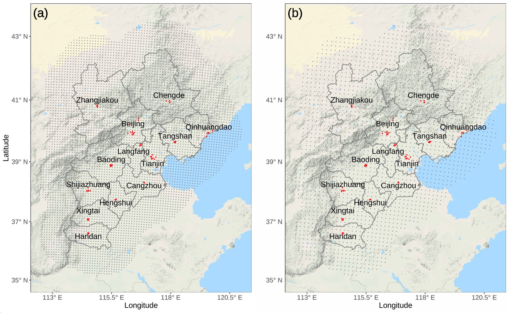
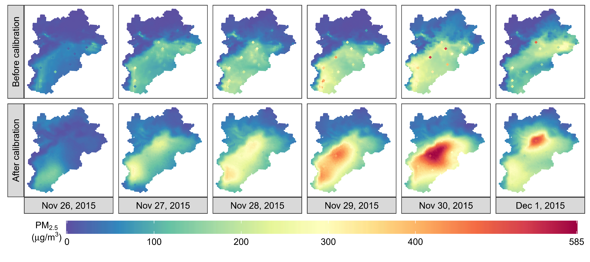

# Additive Dynamic Models for Correcting Numerical Model Outputs
Data and Code for the paper: ''Additive Dynamic Models for Correcting Numerical Model Outputs'' by Y. Chen, X. Chang, F. Luo, and H. Huang. 

## Data

Daily $PM_{2.5}$ concentrations of China's Beijing-Tianjin-Hebei (BTH) region are from two sources, namely the Community Multiscale Air Quality (CMAQ) system and national monitoring stations. The datasets contain the winter of 2015 described in Section 2 of the manuscript. Besides $PM_{2.5}$ concentrations, these datasets contain many necessary covariates, such as longitude, latitude, air pressure, temperature, cumulative wind power, and other variables.

There are several .RData files:
-	SiteData.RData is for $PM_{2.5}$ concentrations from 68 monitoring stations, which had been fused with outputs from numerical models by downscaler methods; see the manuscript for more details on data fusion;
-	China_BTH_GeoMap.RData is for the related geographic data that can be used to plot maps of the BTH region;
- CMAQ_NAQPMS_Grid_Cell.RData is for the grid cell coordinates of two numerical models;
- Other data files such as Simu_data.RData are used to test models, which were generated from a model with a nonseparable spatio-temporal covariance of the
Gneiting class (Gneiting, 2002).

We have developed an R package - [ADCM](https://github.com/ChenYW68/ADCM/tree/main/ADCMs/LoadPackages/) for this work. Using our `ADCM` package, these data files can be loaded by using the ``data'' function. 


### Spatial distributions for the monitoring stations and two numerical model grid cells in the BTH region
<figure id="Figure1">
<p align="center">
  
 </p>
  <figcaption>
  <strong>Figure 1:</strong> Maps of the BTH region under different gridding systems with the locations of 68 monitoring stations marked by the
red dots. (a) Map with the centroids of 5,587 9-km CMAQ grids (gray dots). (b) Map with the centroids of 2,141 15-km NAQPMS
grids (gray dots).
  </figcaption>

</figure>

## Codes
There are two parts to our codes: 
1. The MEnKS-EM algorithm was written into the [ADCM](https://github.com/ChenYW68/ADCM/tree/main/ADCM/package) package in the R statistical environment;
2. A project entitled ``[ADCMs.Rproj](https://github.com/ChenYW68/ADCM/tree/main/ADCMs)'' in the [RStudio](https://www.rstudio.com/products/rstudio/download/) environment was built to reproduce all the results (e.g., figures and tables) in this work. 

```
# Require core package
1. R >= 4.2.1
2. Rcpp >= 1.0.7
3. mgcv >= 1.8-41
```
## Installing and loading dependent packages
-	Open the project file, ``[ADCMs.Rproj](https://github.com/ChenYW68/ADCM/tree/main/ADCM)'', based on the [RStudio](https://www.rstudio.com/products/rstudio/download/) tool.

-	Install all the dependent packages via the following command:
```
source("./LoadPackages/RDependPackages.R")
```
Moreover, the [ADCM](https://github.com/ChenYW68/ADCM/tree/main/ADCM/package) package can be installed by running:
```
 install.packages("./LoadPackages/ADCM_1.0.zip", repos = NULL, type = "win.binary")
```

## An example for the proposed addictive dynamic correction model (ADCM)
```
# remove.packages("ADCM")
# install.packages("./LoadPackages/ADCM_1.0.zip", 
#                  repos = NULL, type = "win.binary")
rm(list = ls())
source("./LoadPackages/RDependPackages.R")
data("SiteData", package = "ADCM")
data("China_BTH_GeoMap", package = "ADCM")
######################################################################
#                  Set tuning parameters
######################################################################
Ch <- .3; Cs <- .1; Ct <- 1; Ne <- 100
######################################################################
######################################################################
# provide a name for all objects that will be saved
tab.1 <- strsplit(as.character(Ch), ".", fixed = TRUE)[[1]][2]
tab.2 <- strsplit(as.character(Cs), ".", fixed = TRUE)[[1]][2]
# tab <- paste0(tab.1, "_", tab.2, "_", Ct)
tab <- paste0("_", tab.1, "_", tab.2)
hdcm.table <- paste0( "ADCM", tab)

######################################################################
# Combine other variables with time variable
######################################################################
DATE_TIME <- unique(obs_PM25_2015w$DATE_TIME) %>% sort()
Nt <- length(DATE_TIME)
date.time <- data.frame(time.index = 1:Nt,
                        time.scale = seq(0, 1, , Nt),
                        DATE_TIME = DATE_TIME)
Model_Base_Table <- obs_PM25_2015w  %>% left_join(date.time, by = c("DATE_TIME"))
######################################################################
######################################################################
# do transformation for some variables 
Model_Base_Table[, c("sim50_CMAQ_PM25")] <- sqrt(Model_Base_Table[, c("sim50_CMAQ_PM25")])
setDT(Model_Base_Table)
######################################################################
######################################################################
# Do grids and create a basis matrix H
######################################################################
colnames(Map_BTH)[1:2] <- c("LON", "LAT")
Boundary <- as.data.frame(t(bbox(China.province.map)))
names(Boundary) <- c("LON", "LAT")
model.Grid <- makeGrids(Boundary, nLayer = 2, NC = 15, nBuffer = 3.5) 
H.basic.data <- CreateHmatrix(grid_coords = model.Grid, 
                              Geo_Map_Coord = China.province.map,
                              method = c("Wendland"), 
                              Site = Site, 
                              factor = 1, 
                              Ch = Ch, 
                              distance.scale = 1e3,
                              Knots.clip.ratio = .10,
                              hs.normal = FALSE) 
######################################################################
#                Constructing data lists used in the ADCM 
######################################################################
ADCM_Data <- Construct_ADCM_Data(data = Model_Base_Table,
                                 include = list(
                                   YEAR = c(2015, 2016),
                                   month_day = c("11-01", "1-31")
                                 ),
                                 Y = "REAL_PM25",
                                 X = c("sim50_CMAQ_PM25"
                                       , "time.scale"
                                       , "sim_TEMP"
                                       , "sim_SPRESS"
                                       , "sim_WIND_X"
                                       , "sim_WIND_Y"
                                 ), 
                                 standard = T, 
                                 center = T, 
                                 start.index = 2)
######################################################################
######################################################################
#                               Model setting
######################################################################
{
  ######################################################################
  #                        Initialize  parameters
  ######################################################################
  nx <- dim(ADCM_Data$X_ts)[1]
  zeta <- sqrt(50/(2*sqrt(2)))
  zeta
  para <- list(beta = list(E_beta = c(3.5, 0.5, rep(0, nx - 2))), 
               rho = list(E_rho = 1e-1) 
               , zeta = list(E_zeta = zeta, lower = 1E-3, upper = 1e1)
               , zeta0 = list(E_zeta0 = zeta, lower = 1E-3, upper = 1e1)
               , phi = list(E_phi = 5e1, lower = 1e1, upper = 5e2) 
               , Obs.sigma.sq = list(E_sigma.sq = 1) 
               , Proc0.tau.sq = list(E_tau.sq = 1)
               , Proc.tau.sq = list(E_tau.sq = 1)
              )
}
######################################################################
######################################################################
#                 The formula for additive mdoels
######################################################################
# the list of parameters for the nonlinear part 
bs <- " 'cc' "; k <- 5
formula.exp <- paste0("REAL_PM25 ~ sim50_CMAQ_PM25  +
s(time.scale, k = ", k + 4, ", bs = ", bs, ", m = 2) +
s(sim_TEMP, k = ", k, ", bs = ", bs, ", m = 2) +
s(sim_SPRESS, k = ", k, ", bs = ", bs, ", m = 2) +
s(sim_WIND_X, k = ", k, ", bs = ", bs, ", m = 2) +
s(sim_WIND_Y, k = ", k + 4, ", bs = ", bs, ", m = 2)")
# formula.exp <- paste0("REAL_PM25 ~ sim50_CMAQ_PM25")
######################################################################
######################################################################
#                          Model fiiting and prediction
######################################################################
star.time <- proc.time()
cv.ADCM <- ADCM(Mean.formula = formula.exp,
                Tab = hdcm.table,
                ADCM.Data = ADCM_Data, 
                H.basic.data = H.basic.data,
                para = para, 
                Ensemble.size = Ne,
                CV = FALSE, 
                plot = TRUE,
                Database = NULL, #list(
                # DSN = odbcConnect(dsn = "DSN_01", 
                #                   uid = "myname",
                #                   pwd = "mypwd",
                #                   believeNRows = FALSE,
                #                   case = "toupper")),
                verbose.EM = TRUE,
                verbose = TRUE, 
                Object = "CITY",
                response.transf = c("sr"),
                itMin = 1e1,
                cs = Cs, 
                ct = Ct,
                tol.real = 1e-2, 
                itMax = 5e1)
end.time <- proc.time()
run_time <- (end.time - star.time)[3] 
######################################################################
######################################################################
save(Fit, file = "./2_Calibration/all_Fit.RData")
```

### Estimated nonlinear functions
Based on the proposed ADCM, we obtained the nonlinear relationships between the observed $PM_{2.5}$ concentrations and other meteorological variables, and Figure 2 presents the estimated nonlinear functions $\hat{g}(\cdot)$ with conditionally simulated 95\% confidence intervals (CI).
<figure id="Figure2">
  <p align="center">
  
    </p>
  <figcaption>
  <strong>Figure 2:</strong> Figures (a)-(e) represent the estimates of functions for time, surface temperature, surface pressure, and eastern and northern cumulative wind powers, respectively.
  </figcaption>
</figure>

### Space-time correction
Figure 3 describes the correction performance of the ADCM for the CMAQ system $PM_{2.5}$ outputs on the entire BTH region from November 26 to December 1, 2015, i.e.,
<figure id="Figure3">
  <p align="center">
  
    </p>
  <figcaption>
  <strong>Figure 3:</strong> CMAQ numerical model outputs before and after the ADCM correction from November 26 to December 1, 2015. The solid squares represent the average $PM_{2.5}$ levels at the monitoring stations.
  </figcaption>
</figure>

##

In each of the 13 cities, the average $PM_{2.5}$ concentration of all the stations in the city is marked using a solid square. The smoother the transition from the cities to the rural areas, the better the overall correction results. It is evident that the before correction CMAQ outputs do not match well with most of the pollution data. After correction, the transition from the cities to their surrounding areas becomes much smoother.
